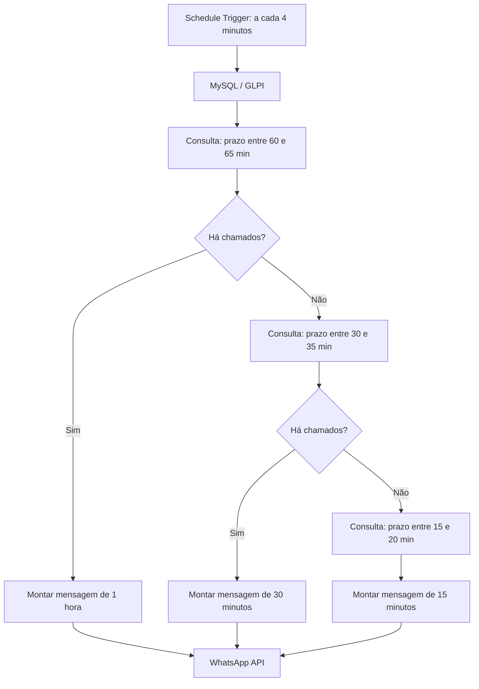
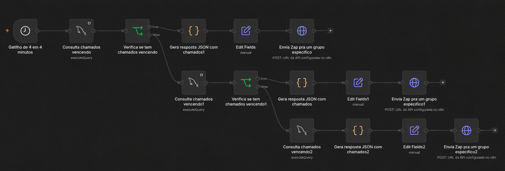

# GLPI SLA WhatsApp Alerts

Automação em n8n para monitoramento preventivo de SLA de chamados do GLPI com notificações via WhatsApp.

Equipes de suporte que utilizam GLPI podem ter chamados próximos de ultrapassar o SLA sem que os técnicos percebam a tempo. Este workflow consulta periodicamente o campo `time_to_resolve` da tabela `glpi_tickets` e envia avisos a um grupo de WhatsApp. Ele auxilia o acompanhamento; não garante o cumprimento do SLA.

## Funcionalidades

- Monitoramento periódico do GLPI a cada 4 minutos.
- Consulta direta ao banco MySQL dos chamados com status `1` ou `2`.
- Identificação de chamados próximos do prazo de resolução.
- Três níveis de alerta: aproximadamente 1 hora, 30 minutos e 15 minutos.
- Geração automática de mensagens com número, hora limite e título do chamado.
- Envio para um grupo pela API de WhatsApp, como Evolution API.
- Configuração das integrações no n8n, reduzindo a dependência de acompanhamento exclusivamente manual.

## Fluxo

A sequência implementada é **1 hora → 30 minutos → 15 minutos**. Se a consulta de 1 hora encontra chamados, envia esse alerta e não percorre as outras janelas naquela execução. Se ela não encontra, verifica 30 minutos; se esta também não encontra, verifica 15 minutos. A terceira consulta não possui um node IF próprio: sem linhas retornadas, o fluxo normalmente termina nela.

As janelas têm cinco minutos de largura porque a verificação ocorre a cada quatro minutos. Elas são fixas no workflow atual. Consulte [Fluxo de alertas](docs/fluxo-alertas.md) para as regras exatas.

## Visualização do workflow

A captura foi editada para ocultar o endereço privado da API nos três nodes de envio. O [JSON publicável](workflows/glpi-sla-alerts.json) contém os mesmos placeholders de segurança.

## Pré-requisitos

- Instância n8n compatível com os nodes do arquivo exportado.
- Acesso de leitura ao MySQL do GLPI e confirmação do campo `time_to_resolve`.
- Serviço de envio de mensagens de WhatsApp com endpoint compatível com `/message/sendText/{instância}`.
- Grupo de destino e credenciais configurados em ambiente privado.

Os códigos de status `1` e `2` dependem da configuração e versão do GLPI: valide seus significados antes de usar em outro ambiente. Confira também o fuso horário do banco e do n8n.

## Configuração

1. Importe [o workflow sanitizado](workflows/glpi-sla-alerts.json) no n8n.
2. Crie uma Credential MySQL com acesso mínimo necessário, preferencialmente somente leitura, e selecione-a nos três nodes de consulta.
3. Crie uma Credential `HTTP Header Auth` para a API de WhatsApp e selecione-a nos três HTTP Request nodes.
4. Configure, em cada HTTP Request node, a URL privada do endpoint e o ID do grupo no parâmetro `number`. O JSON público usa `xxxxxxxxxxxxxxxxxxxx` como placeholder; ele não envia mensagens até que esses campos sejam configurados.
5. Confirme os status do GLPI, `time_to_resolve`, fuso horário e acesso de rede. Teste em um grupo de homologação antes de ativar o agendamento.

O arquivo [.env.example](.env.example) é uma lista de valores a manter fora do Git. **O workflow atual não lê essas variáveis automaticamente**: configure os nodes e as Credentials no n8n. Veja [Configuração do GLPI](docs/configuracao-glpi.md) e [Integrações](docs/integracoes.md).

## Estrutura

| Caminho | Conteúdo |
| --- | --- |
| `workflows/glpi-sla-alerts.json` | Export sanitizado e importável no n8n |
| `docs/arquitetura.md` | Componentes e fluxo de dados |
| `docs/fluxo-alertas.md` | Janelas, consultas e sequência de alertas |
| `docs/configuracao-glpi.md` | Requisitos do banco e validações |
| `docs/integracoes.md` | Configuração da API de WhatsApp |
| `docs/seguranca.md` | Cuidados com credenciais e exports |
| `docs/melhorias-futuras.md` | Ideias não implementadas |
| `examples/mensagens.md` | Exemplos fictícios das mensagens |

O export original foi preservado apenas localmente em `originals/workflow-original.json`; essa pasta é ignorada pelo Git por conter dados privados. Publique somente a versão sanitizada. Consulte [Segurança](docs/seguranca.md) antes de gerar outro export.
