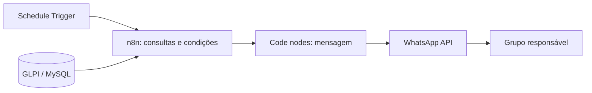

# Arquitetura

O n8n orquestra as verificações e a entrega dos avisos. O Schedule Trigger inicia uma execução a cada quatro minutos. Os nodes MySQL consultam `glpi_tickets` no banco do GLPI. Os nodes IF controlam a passagem das consultas de 1 hora e 30 minutos; os Code nodes montam as mensagens. Os HTTP Request nodes enviam o texto ao grupo pela API de WhatsApp.

A leitura do banco e o envio à API exigem Credentials separadas no n8n. Os detalhes de rede e as chaves são configurados no ambiente de execução; o export público contém placeholders. O fluxo segue as conexões originais e não inclui persistência própria de alertas enviados.
